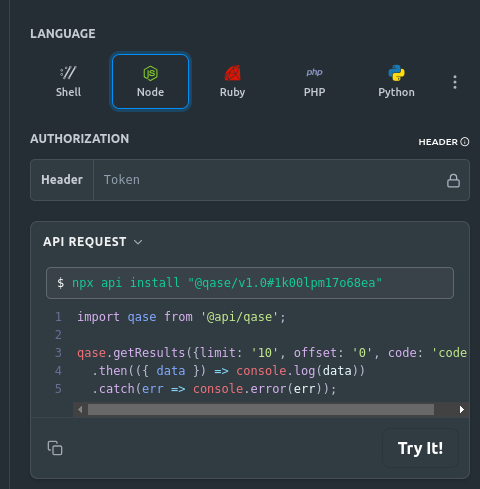

# PactumJs Automated Tests Skeleton [](https://github.com/RichardLitt/standard-readme)


## 📐 Getting Started

### 1️⃣ Add the environments files

Create a new file from ```src/environment/environment-schema.json```. Then, replace ```ENVIRONMENT_NAME``` by the environment name (e.g. _PRODUCTION.json_).

### 2️⃣ Build Skeleton

To build the skeleton you must run the next command:

```bash
# Build project
$ npm run build
```

Or rebuild the skeleton removing the previously downloaded libs:

```bash
# Clean, build project and install dependencies
$ npm run clean-build
```

### 3️⃣  Run tests
To run tests, replace the ENVIRONMENT_NAME by the environment name and the LANGUAGE by the language alias, defined in the fixtures folder (Step 1).

```bash
# Run tests
$ npm run test -- --environment=ENVIRONMENT_NAME --language=LANGUAGE

Examples: 
$ npm run test -- --environment=APPLICATIONS-EXAMPLE --group=DragonBall --language=ES
$ npm run test -- --environment=AV-EXAMPLE --group=Restaurant --language=ES
```

#### 3️⃣.1️⃣ Run tests filtered by "group".
* Add the ```--group``` parameter in the command to filter by group. In addition, it is able to mix groups: ```--group=ES/regression```
* Exclude groups using '-': ```--group=-ES```

```bash
# Run tests filtered by group
$ npm run test -- --environment=ENVIRONMENT_NAME --group=FILTER --language=LANGUAGE

Examples: 
$ npm run test -- --environment=APPLICATIONS-EXAMPLE --group=DragonBall --group=ES 
$ npm run test -- --environment=AV-EXAMPLE --group=Restaurant --language=ES --group=Pizza
```

#### 3️⃣.2️⃣ Run tests and Export them.
Execute the ```test-with-output``` command to run the tests and export the results in the file _output.json_:

```bash
# Run tests and export result in output.json file
$ npm run test-with-output -- --environment=ENVIRONMENT_NAME --language=LANGUAGE

Examples: 
$ npm run test-with-output -- --environment=APPLICATIONS-EXAMPLE --group=DragonBall --language=ES
$ npm run test-with-output -- --environment=AV-EXAMPLE --group=Restaurant --language=ES
``` 

### 4️⃣  Upload a Test run to QASE

⚠️ ⚠️ ⚠️ ⚠️ **CONFIGURE QASE PROJECT FIRST**, OTHERWISE THE TESTS WILL BE REPLACED AND YOU WILL LOSE YOUR DATA. ⚠️ ⚠️ ⚠️ ⚠️

After executing the tests, they can be uploaded to QASE by creating a new test run from scratch.

1. Install the QASE api (https://developers.qase.io/reference/get-results) executing the command for Node. Later, select TypeScript language in the prompt.




2. Generate the output.json file with the test results. Use ```test-with-output``` command to run and export results.

3. Upload to a new test run in QASE executing the next command. ⚠️ Remember to add QASE variables in the environment file!!! ```pactumjs/src/environments```


```bash
# Find differencies in automated tests
$ npm run upload-results -- --environment=ENVIRONMENT_NAME --name="NAME OF THE TEST RUN"

Examples: 
$ npm run upload-results -- --environment=APPLICATIONS-EXAMPLE --name="[TASK-1234] Test run of tests"
$ npm run upload-results -- --environment=AV-EXAMPLE --name="[TASK-1234] Test run of tests"
```
